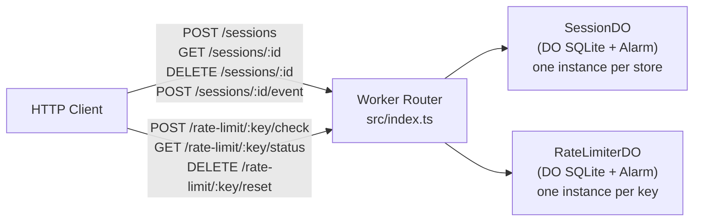

# session-gate

Two Durable Object classes backed by DO SQLite — a session store with alarm-driven expiry (`SessionDO`) and a per-key sliding-window rate limiter (`RateLimiterDO`).

## Architecture



## Endpoints

| Method | Path | Description |
|--------|------|-------------|
| `POST` | `/sessions` | Create a new session (`{ data?, ttlSeconds? }`) |
| `GET` | `/sessions/:id` | Read session (404 if expired) |
| `DELETE` | `/sessions/:id` | Invalidate session immediately |
| `POST` | `/sessions/:id/event` | Increment event counter for a session |
| `POST` | `/rate-limit/:key/check` | Check + consume a rate-limit token |
| `GET` | `/rate-limit/:key/status` | Read current window state |
| `DELETE` | `/rate-limit/:key/reset` | Reset the window |
| `GET` | `/health` | Health check (`{ status: "ok" }`) |

## Single-Writer Concurrency

DO's single-writer model guarantees that 100 concurrent HTTP requests to `/sessions/:id/event` will all serialize through the one DO instance. The `event_count` increment is atomic (`UPDATE … RETURNING event_count`), so the final count will always equal exactly 100.

**MJ concurrency test:**
```bash
SESSION_ID=<your-session-id>
# Fire 100 concurrent events
for i in $(seq 1 100); do
  curl -s -X POST "https://<your-worker>.workers.dev/sessions/$SESSION_ID/event" &
done
wait
# Check final count
curl "https://<your-worker>.workers.dev/sessions/$SESSION_ID" | jq .eventCount
# → should be exactly 100
```

## Setup & Deploy

```bash
npm install
npm run deploy
```

No D1 setup needed — DO SQLite is per-instance and schema is applied automatically in the DO constructor.

## Tests

```bash
npm test
```

Covers: session create/read/delete, event counter correctness, rate limiter allow/reject, health endpoint.
